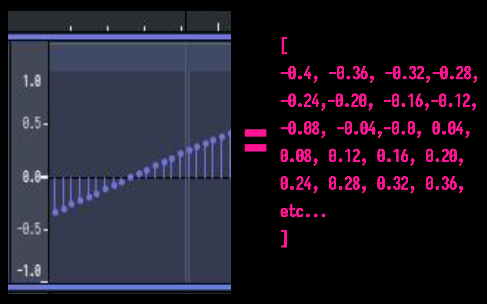
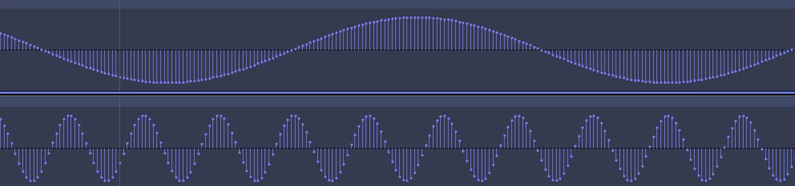
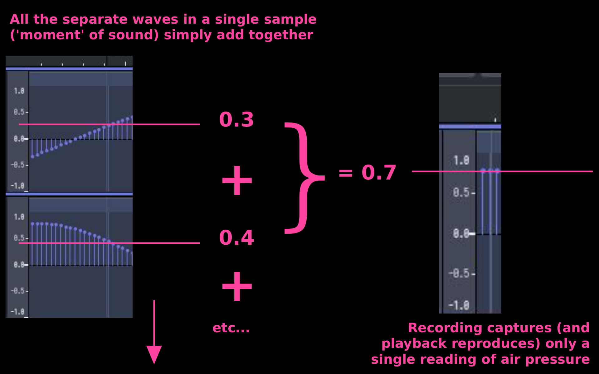
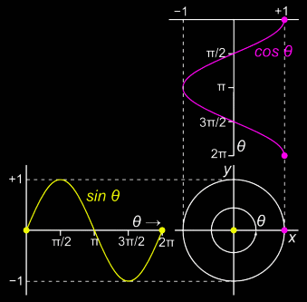
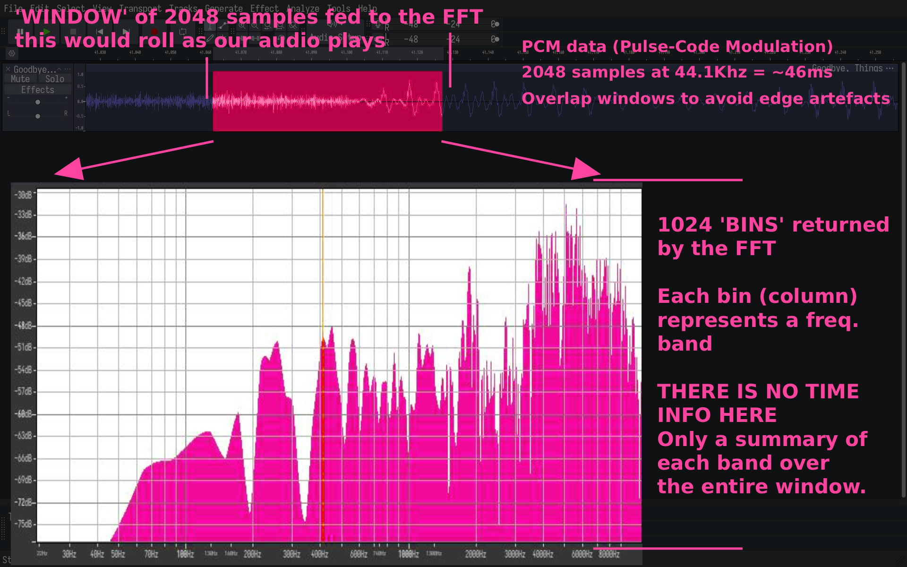

# PCM Data

### To visualise audio, we need access to PCM (Pulse-Code modulation) data

This is just the usual stuff we're used to looking at in audio editors: bunch of numbers, each representing a sample.

> Something needs to provide PCM data for us in real time, eg in Flutter I'll use a package which provides me with arrays of numbers for audio which is currently playing. 

### A single sample is just a number:
- Has no meaning in isolation
- Is a representation of air pressure (as read by a microphone or output by a speaker)
- Contains no info about frequency

This is just 2 sound waves but imagine the many dozens or hundreds that would make up real world sound or music.

### Combining sine waves

---

# Sine Waves as Wheels

> Sine waves can be visualised as spinning wheels

### `Wheel Size = Amplitude` (Volume)
- A big wheel is a loud sound 
- Smaller is quieter

### `Spin Speed = Pitch` (Frequency)
- A fast wheel is high treble
- A slow wheel is low bass tone

> Picture a point on a wheel. Its coordinates, changing as the wheel spins, can express the above data:

### Amplitude/volume 
- The difference between the highest and lowest points on (let's say) a y axis

### Pitch/frequency 
- How long it takes for the point to repeat

---

# Fourier's Theorum

### Every function can be completely expressed as a sum of sines and cosines of various amplitudes and frequencies

Which for our purposes means:
> Any sound wave, no matter how complex, can be decomposed into a sum of simple sine waves at different frequencies and amplitudes.

### Complex numbers

> This is fuzzy and not perfectly correct mathematically, but a good enough analogy for our understanding

- Internally, FFTs use complex numbers to represent the 'spinning wheels'
- For our purposes we can think of a complex number as just being a pair of coordinates
- The size and speed of a wheel can be represented as a list of coordinate pairs (eg position of the point on the wheel on each 'frame' of the above animation)

---

# Getting the Music Back Out of the Numbers

> We need to decompose the stream of numbers (samples) to get back to something more like music.

### Source separation 
True source separation (separating a kick drum from a vocal from a guitar) is difficult, processor-intensive etc. Can be
done with machine learning but not realtime on normal devices.

### Frequency band decomposition
An FTT gives us output that we can easily split into bands (sub-bass, bass, mids, highs). Each band can be a "voice" to drive a different visual element.

---

# FFTs

### Samples in / bins out
- While audio plays, we can repeatedly pass samples to a FTT in a chunk ('window')
- We will get a group of 'bin's in response
- Each bin represents a frequency band, and has a value to indicate how much of that frequency appeared in the window
  (amplitude for the band)

### Sample window and timing

### Time-frequency uncertainty principle

Choosing the best window size is a trade-off:
- A longer window gives you better frequency resolution (you can distinguish two very close pitches) but worse time resolution, because you're smearing across a longer slice of time
- A shorter window gives you better time resolution (you can pinpoint _when_ something happened) but worse frequency resolution, because you haven't seen enough cycles to accurately measure slow wheels

---

# Onset detection
