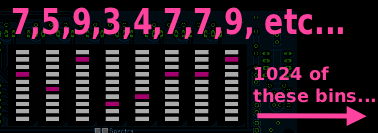

# PCM Data

### To visualise audio, we need access to PCM (Pulse-Code modulation) data

> **For real-time visuals, we need access to real-time PCM data**  
> Eg: In Flutter I'll use a package which will periodically provide me with byte arrays (or similar) for the currently-playing audio

PCM is what we're used to seeing in audio editors: a bunch of numbers, each representing a sample.

### A sample is just a number:
- Is a representation of air pressure (as read by a microphone or output by a speaker)
- Contains no info about frequency
- In isolation, it usually wouldn't even sound like anything

---

# Permissions and access to audio

This is a difficult situation. Modern OSes tend towards isolation of apps and Digital Rights Management. 

In terms of **listening to other apps**:
- Android: Possible but apps can opt out of it (eg Spotify opts out)
- iOS: Forget it
- Desktop: More chance of it being possible

Other options:
- Play the audio yourself (be the player)
- Use the mic

---

# Sine Waves

### Fourier's Theorum: "Every function can be completely expressed as a sum of sines and cosines of various amplitudes and frequencies"

Which for our purposes means:
> Any sound wave, no matter how complex, can be decomposed into a sum of simple sine waves at different frequencies and amplitudes.

### Even simpler version: **It's all just sine waves!**

2 sound waves... music and real world sounds would be made up of many dozens, hundreds or more.

### Combining sine waves

---

# Getting the Music Back Out of the Numbers

> We need a way to take the stream of numbers (samples) and derive something more representative of the original music

### Source separation (hard!)
True source separation (accurately separating a kick drum from a vocal from a guitar) is difficult, processor-intensive etc. Can be
done with machine learning but not real-time on normal devices.

### Frequency band decomposition

With help of an FFT, we can take a small chunk of audio and work out which sine waves (frequencies) are present, and how powerful each is.

- An FTT gives us very detailed output that we can then group into more useful bands (eg sub-bass, bass, mids, highs)
- Each of those bands can then be used to drive a different visual element

---

# FFTs

> The FFT gives us a breakdown of how strongly-represented each frequency band is in a given _window_

### NB: A _window_ is a small chunk of samples (a few milliseconds of audio)

### IN: Sample window
- While audio plays, we send the latest _window_ into the FTT
- As play continues we shift the window along in time with the audio
- Each window should overlap with the previous one to prevent audio artifacts

### OUT: Bins
- For each window we'll get a group of _bins_ in response
- Each _bin_ represents a frequency band 
- Each _bin_ has a value, which is our amplitude or volume for that frequency band
- The value is an average for the entire window we passed in

### Choosing the best window size is a trade-off

**Longer window**
- Can capture lower frequencies, because an entire cycle of a frequency's sine wave must be present in the window (and low frequencies are longer/slower)
- Lower time resolution: we only know the levels of each frequency for the **entire window**, so if it's too long we
  might respond too slowly to very short sounds

**Shorter window**
- Better time resolution (pinpoint more precisely _when_ something happened) but will miss lower frequencies

### We only move the window by a fraction of its size
We run FFTs continuously on overlapping windows of samples as the audio plays. A typical window might be:
- 2048 samples 
- advancing by 512 samples each time
- this overlap is important for temporal smoothness, and the technique is called a Short-Time Fourier Transform or STFT

> At 44,100 Hz sample rate, 512 samples is about 12 milliseconds — so you're getting a fresh frequency snapshot roughly 86 times per second

**One gotcha — the window function**

Raw FFTs on a rectangular chunk of samples produce artefacts at the edges (because the maths assumes the signal repeats, and the discontinuity at the boundary creates phantom frequencies). In practice you multiply your sample window by a smoothing curve — called a Hann or Hamming window — before running the FFT. Every audio analysis library does this for you, but it's worth knowing it exists because it affects the frequency resolution of your output.

---
---
---
---
# ! NOTES BELOW ARE INCOMPLETE !
---
---
---

# Onset Detection

---

# FFT Internals

---

# Sine Waves as Wheels

> Sine waves can be visualised as spinning wheels

### `Wheel Size = Amplitude` (Volume)
- A big wheel is a loud sound 
- Smaller is quieter

### `Spin Speed = Pitch` (Frequency)
- A fast wheel is high treble
- A slow wheel is low bass tone

> Picture a point on a wheel. Its coordinates, changing as the wheel spins, can express the above data:

### Amplitude/volume 
- The difference between the highest and lowest points on (let's say) a y axis

### Pitch/frequency 
- How long it takes for the cycle to repeat 

### Complex numbers

> This is fuzzy and not perfectly correct mathematically, but a good enough analogy for our understanding

- Internally, FFTs use complex numbers to represent the 'spinning wheels'
- For our purposes we can think of a complex number as just being a pair of coordinates
- The size and speed of a wheel can be represented as a list of coordinate pairs (eg position of the point on the wheel on each 'frame' of the above animation)

---
